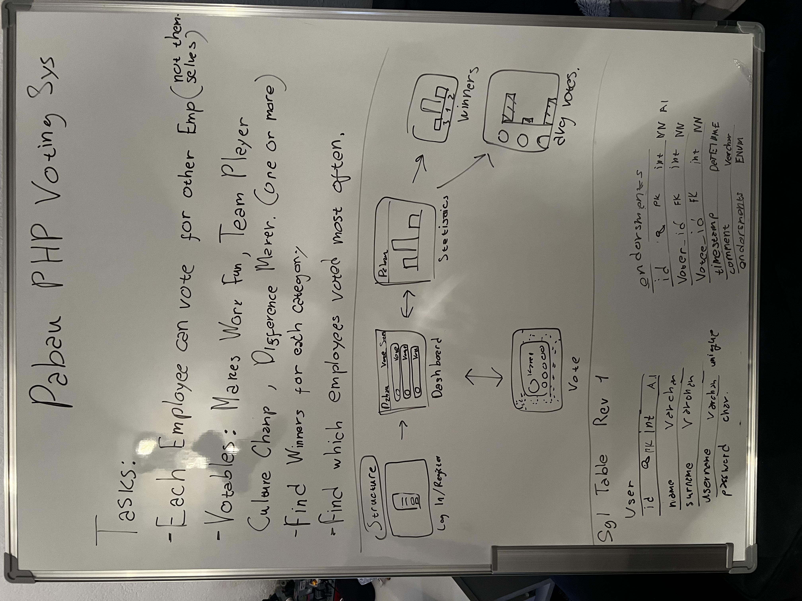
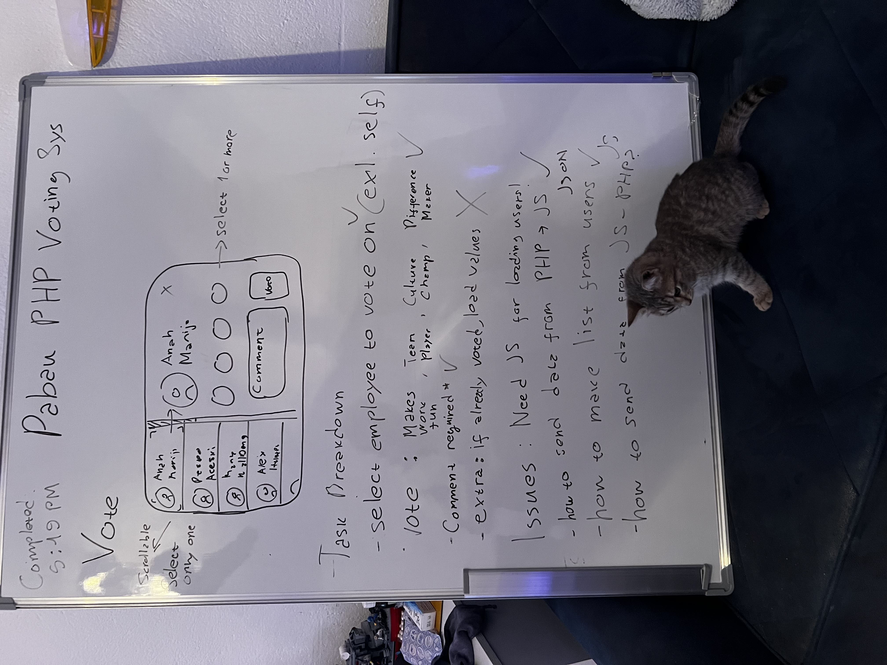
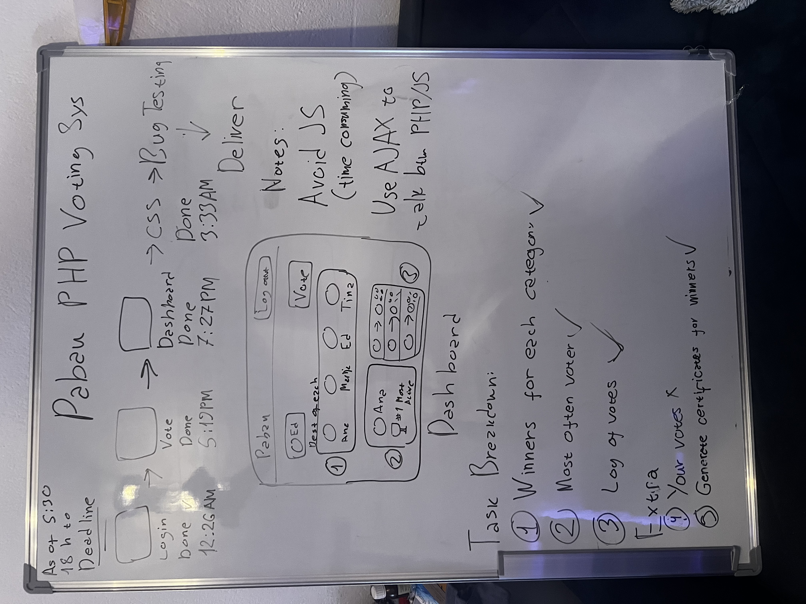
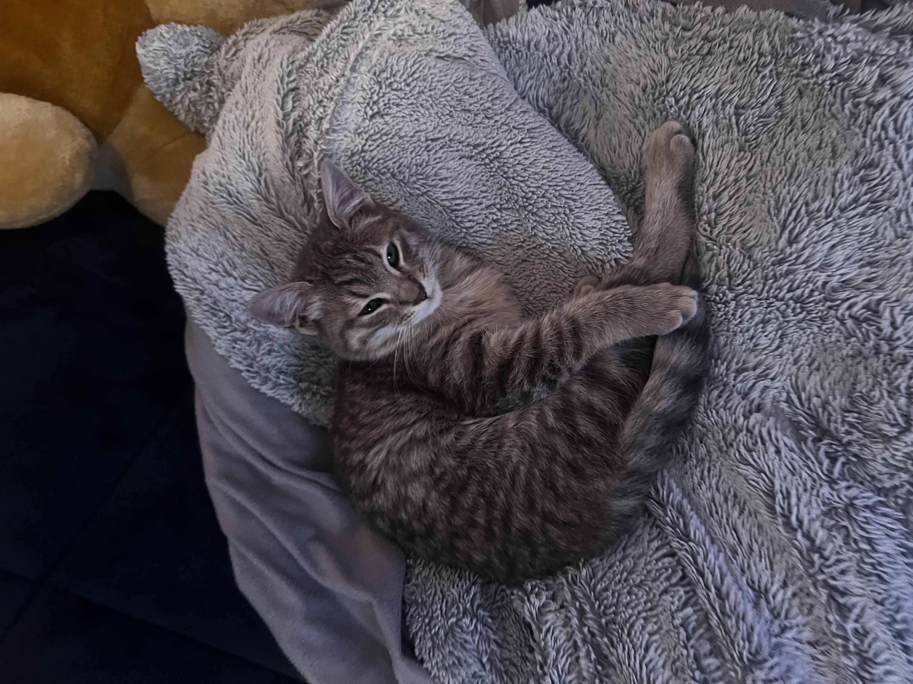

# PHP Endorsement System
This is a simple PHP-based application that uses HTML, CSS, JavaScript, 
jQuery, and AJAX for the front end and
PHP with MySQL for the back end. 

## Guide on installation
When building this project I used XAMPP
with Apache and MySQL
You can use it, or use your own DB as long as its MySQL

If you are going with the XAMPP route start from step 1
otherwise, go to step 6;

1. Download XAMPP and make sure you check PHPmyadmin, MySQL and PHP.
2. Once installed. head over to  .../xampp/htdocs/
3. Make a folder (ex. Website) and clone the repo inside
4. Now open up XAMPP (you are going to have to use admin mode all through as XAMPP is buggy if not elevated)
5. Run Apache and MySQL (If you run into errors go to xampp/php/php.ini and uncomment the "extension=mysqli"
6. Go to [localhost](http://localhost/phpmyadmin/) (or your db management tool of choice)
7. Go to Import and drop the file from the project ( website/sql/db.sql )
8. Finally visit the website on [website](http://localhost/website/)
9. Please read the notice below before reading and dissecting the code!

## The way I worked on this project
You can catch a glimpse in the pictures below of how I think, break down problems and guess issues.
I began by looking at what I wanted at the end, taking away all the extra features and working on the barebones

Then one by one, I implemented features I estimated would not delay me arriving at the deadline and still give me solid results

Sometimes, not all features can or should be implemented. Adding more features clutters the user experience and breaks our image,
making us take more time to solve problems

## NOTICE READ THIS BEFORE YOU SEE MY CODE

Please take into consideration that this is my first PHP project, and before this, I had practically 0 experience writing PHP. 
Surprisingly the PHP part was the easiest part, as I blew right through every obstacle with PHP. 
My biggest issue was working with JS, which I have experience with but not this in-depth. 
AJAX and JQUERY were two technologies I have never worked with,  and as such you will notice a lot of redundant code because of it. 
Most of this redundancy could have been avoided, and 99% of the project would have been pure PHP if I had learned a bit earlier that I could 
put php values in between HTML. 
I don't know if I breached any unspoken internship rule as I haven't read any but I feel morally obliged to notify you of the following:
I have used AI in this project. But not as a code-writing tool but as a search engine to figure out problems and brainstorm ideas.
I have also used code snippets from StackOverflow and a git repo from CodeSnippets for the certificate

I hope this project shows you that even though I may not have the nescessary knowledge at first, I learn fast and always persevere, always resulting to success!

## Cat!

